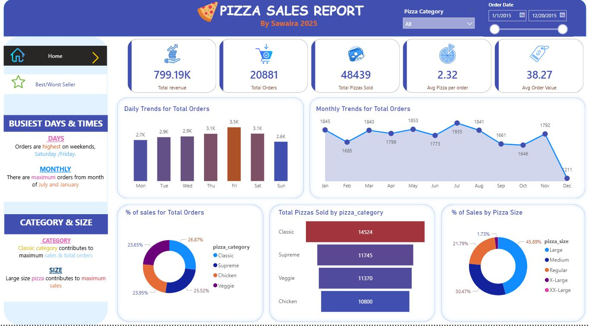
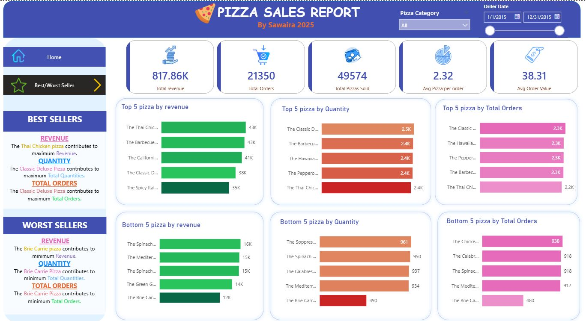

# 🍕 Pizza Sales Dashboard – Power BI Project

This repository contains an interactive **Pizza Sales Dashboard** built using **Power BI** by **Sawaira**.  
It provides deep insights into pizza sales performance, customer behavior, busiest days, best/worst sellers, and trends through both **Power BI visuals** and **SQL queries**.

  

---

## 📁 Files Included

| File Name                           | Description                                      |
|------------------------------------|--------------------------------------------------|
| `Pizza Sales Report.pbix`          | Power BI dashboard project file                  |
| `pizza_sales.csv`                   | Raw dataset used for building the dashboard      |
| `PIZZA SALES SQL Steps.docx`        | Documented SQL queries and DAX steps             |
| `Home.JPG`                          | Dashboard Home Page preview                      |
| `BestWorstSellers.JPG`              | Dashboard Best/Worst Sellers preview             |

---

## 💡 Key Features

- 📌 **KPI Tiles**:
  - 🔹 Total Revenue: `817K`
  - 🔹 Total Orders: `21K`
  - 🔹 Total Pizzas Sold: `49K`
  - 🔹 Avg Order Value: `38`
  - 🔹 Avg Pizzas per Order: `2.3`

- 📊 **Visual Insights**:
  - Top 5 & Bottom 5 Pizzas by Revenue, Quantity, and Orders
  - Daily Trends for Total Orders (Mon–Sun)
  - Monthly Trends for Orders (Jan–Dec)
  - % Sales by Pizza Category & Size

- 🎯 **Best/Worst Sellers Analysis**:
  - Highlights pizzas generating the **maximum** and **minimum** revenue, quantity, and orders.

- 📈 **SQL Integration**:
  - KPIs and trends calculated using SQL queries for validation alongside Power BI.

---

## 🎨 Visual Components

- **Bar Charts** → Top/Bottom Pizza by Sales, Daily/Monthly Orders  
- **Line Charts** → Monthly Trends  
- **Donut Charts** → % Sales by Category & Size  
- **KPI Cards** → Core business metrics  
- **Text Cards** → Business Insights (Best/Worst sellers, busiest days/months)  

---

## 🛠️ Tools & Technologies

- **Power BI Desktop**  
- **SQL (PostgreSQL)**  
- **CSV Dataset**  
- **DAX Measures**  
- **Data Transformation & Modeling**

---

## 🚀 Getting Started

To explore the dashboard:

1. Download the `.pbix` file from this repo.  
2. Open in **Power BI Desktop**.  
3. Review KPIs, slicers (Category, Date), and dynamic visuals.  
4. Use provided SQL queries for validation or database integration.  

---

## 📌 Use Case

This project is ideal for:  
- Portfolio building for **Data Analysts / BI Developers**  
- Demonstrating **SQL + Power BI integration**  
- Business stakeholders tracking product sales, seasonal patterns, and top-performing pizzas  

---

## 👩‍💻 Author

**Sawaira Iqbal**  
> Power BI & SQL Developer | Data Visualization Enthusiast  
> _Crafted with 🍕 + 💖 to turn raw data into actionable insights_

---

⭐ *If you found this project useful, don’t forget to give it a star!*  
